# 01 · Spotify Discovery Pain — AI Review Discovery Engine

[](https://nl-spotify-discovery-pml.streamlit.app/)
[](https://nl-ai-review-discovery-engine.vercel.app/)
[](https://nlaireviewdiscoveryengine-production.up.railway.app/api/health)
[](https://github.com/mmishra0321/NL_AIReviewDiscoveryEngine/actions/workflows/refresh.yml)

> Part 1 of a 3-folder capstone PM project on Spotify music discovery. An AI-native workflow that mines Spotify user feedback at scale to surface **why discovery feels broken** — even with world-class recommendation infrastructure.

**🎧 Live surfaces**

| Surface | URL | Host | Purpose |
|---|---|---|---|
| Streamlit dashboard | [`nl-spotify-discovery-pml.streamlit.app`](https://nl-spotify-discovery-pml.streamlit.app/) | Streamlit Community Cloud | Zero-ops fallback UI, auto-redeploys on every push to `main` |
| React SPA (Vercel) | [`nl-ai-review-discovery-engine.vercel.app`](https://nl-ai-review-discovery-engine.vercel.app/) | Vercel | Primary UI, richer interactions, hits the API below |
| FastAPI backend | [`.../api/health`](https://nlaireviewdiscoveryengine-production.up.railway.app/api/health) | Railway | Serves the SPA; caches precomputed answers + Chroma retrieval |

**Sibling folders**

| Folder | Role |
|---|---|
| [`../02-mvp/`](../02-mvp/) | The AI-native product MVP (Pulse) that operationalises these insights into a working reset flow. |
| [`../03-research-and-deck/`](../03-research-and-deck/) | Interviews, problem definition, and the final 10-slide deck. |

**Read first**

- [`doc/problemStatement.md`](./doc/problemStatement.md) — full project brief and this engine's mandate
- [`doc/architecture.md`](./doc/architecture.md) — deep-dive: every component mapped to a source file
- [`doc/deployment.md`](./doc/deployment.md) — Streamlit Cloud + GitHub Actions deployment recipe

---

## 1. Working hypothesis

Spotify's algorithmic discovery (Discover Weekly, Release Radar, Daily Mixes) over-indexes on listening history and creates a **filter bubble**. Users who *want* to discover new music can't escape their past — especially across mood shifts, genre crossings, and language/regional boundaries. Even discovery-motivated users end up replaying familiar tracks.

This engine either confirms or rejects that hypothesis with evidence pulled from **real user reviews** — no synthetic personas, no analyst opinion. The 6 canonical PM questions the brief demanded are answered, at scale, from that evidence.

## 2. What the engine does (end-to-end)

```
scrape → normalize → LLM-filter → embed → index →
        precompute canonical answers → serve via API + UI
              ↑                                ↓
              └── weekly GitHub Actions cron ──┘
```

1. **Scrapes** Spotify reviews from **App Store** (iTunes RSS, 5 storefronts) and **Play Store** (google-play-scraper, 6 storefronts), plus **YouTube** comments and **100 curated seed reviews**. Reddit is deferred to v2.
2. **Normalizes + dedupes** using SHA-256 stable IDs so re-scrapes are idempotent.
3. **Filters** to discovery-relevant reviews using a Groq **Llama 3.1 8B Instant** classifier that also assigns canonical-question tags (Q1–Q6) in the same call.
4. **Embeds** filtered reviews locally with `sentence-transformers/all-MiniLM-L6-v2` (384-dim, CPU) — zero API cost, deterministic across runs.
5. **Indexes** into a persistent **ChromaDB** collection (`spotify_reviews`) that is committed to the repo (~5 MB), so redeploys are stateless.
6. **Pre-computes** the 6 canonical answers via RAG (retrieve → MMR re-rank → Groq **Llama 3.3 70B Versatile** synthesis) and writes them to `data/insights/canonical_answers.json` — so the dashboard renders instantly.
7. **Wraps** custom user questions with a **hybrid scope guardrail**: a cosine fast-path handles ~95 % of queries with zero LLM calls; only genuinely borderline queries escalate to an LLM classifier.
8. **Serves** the whole thing through **two coexisting UIs**:
   - A **FastAPI + React (Vite) SPA** — the primary interface, richer UX (`backend/main.py` + `frontend/`)
   - A **Streamlit dashboard** — kept as a zero-ops fallback for Streamlit Community Cloud (`app/streamlit_app.py`)
9. **Refreshes** every Monday at 02:00 UTC via a GitHub Actions cron that reruns the full pipeline, commits the new data, and lets Streamlit Cloud auto-redeploy.

## 3. Current data snapshot

Numbers below are the state of the repo after the most recent weekly refresh (`data/metadata.json`, refreshed 2026-06-29):

| Metric | Value |
|---|---|
| Reviews normalized | **1,000** |
| Reviews marked discovery-relevant | **430** (43 %) |
| Vectors in ChromaDB | **705** |
| Source mix | 100 curated seed · 309 Play Store · 80 App Store · 511 YouTube |
| Canonical-tag mix | Q1_struggle 38 · Q2_frustrations 119 · Q3_jobs 193 · Q4_repetition 76 · Q5_segments 29 · Q6_unmet 43 |
| Top Spotify features surfaced | Discover Weekly, Premium, Ads, DJ, Podcasts, Playlists, Release Radar, Liked Songs |

## 4. The 6 canonical PM questions

The engine ships precomputed, evidence-cited answers for each of these on every refresh:

1. Why do users struggle to discover new music?
2. What are the most common frustrations with recommendations?
3. What listening behaviours are users trying to achieve?
4. What causes users to repeatedly listen to the same content?
5. Which user segments experience different discovery challenges?
6. What unmet needs emerge consistently across reviews?

## 5. Architecture at a glance

```mermaid
flowchart LR
    subgraph SRC[Data Sources]
        S1[App Store<br/>iTunes RSS · 5 storefronts]
        S2[Play Store<br/>google-play-scraper · 6 storefronts]
        S3[YouTube comments]
        S4[Curated seed · 100]
    end

    subgraph CI[Weekly GitHub Actions · cron 02:00 UTC Mon]
        N[Normalize + Dedupe<br/>SHA-256 stable ID]
        R[Discovery-Relevance Filter<br/>Groq Llama 3.1 8B · batched JSON]
        E[Local Embeddings<br/>MiniLM 384-dim · CPU]
        V[(ChromaDB<br/>committed to repo)]
        P[Precompute 6 Canonical Answers<br/>Retrieve → MMR → Groq 70B]
        M[metadata.json<br/>git commit + push]
    end

    subgraph API[FastAPI backend · uvicorn :8000]
        H[/api/health, /api/meta/]
        C6[/api/canonical, /api/canonical/&#123;id&#125;/]
        A[/api/ask · scope + live RAG/]
        RL[/api/reviews · paginated browse/]
        X[/api/export.xlsx/]
        AH[/api/actions · GH runs history/]
    end

    subgraph UI[React SPA · Vite :5173  &nbsp;/&nbsp;  Streamlit :8501 fallback]
        HG[6 Canonical Answer Cards]
        AB[Ask-Your-Own with scope guard]
        RV[Paginated Review Evidence]
        MB[Metadata Bar + Excel Export]
        AC[Actions History]
    end

    S1 --> N
    S2 --> N
    S3 --> N
    S4 --> N
    N --> R --> E --> V --> P --> M
    V -.-> API
    P -.-> API
    M -.-> API
    API --> UI
```



Full component-by-component walkthrough with sequence diagrams: **[`doc/architecture.md`](./doc/architecture.md)**.

## 6. Tech stack

| Layer | Tool | Why this |
|---|---|---|
| **Fast LLM (classify)** | Groq Llama 3.1 8B Instant | ~10× cheaper than 70B, plenty for JSON-mode batch classification of 10 reviews per call |
| **Reasoning LLM (synthesise)** | Groq Llama 3.3 70B Versatile | High-quality answers for the 6 canonical questions; only 6 calls per refresh + 1 per custom user query |
| **Embeddings** | `sentence-transformers/all-MiniLM-L6-v2` (384-dim, CPU, ~80 MB) | Zero API cost, no rate limit, deterministic across deploys |
| **Vector store** | ChromaDB (persistent, committed) | Free-tier friendly, no external DB, ~5 MB on disk for ~700 reviews |
| **Retrieval** | Cosine top-25 → **MMR re-rank** (λ = 0.7) → top-15 | Cuts near-duplicates so the LLM sees diverse evidence |
| **Scope guardrail** | Hybrid: cosine fast-path (thresholds 0.55 / 0.30) → Groq 8B fallback on borderline | ~95 % of queries decided with zero LLM calls |
| **Scraping** | `google-play-scraper`, native iTunes RSS, `youtube-comment-downloader` | No API keys, no third-party rate limits |
| **Reliability** | `tenacity` exponential backoff on Groq 429s, stable SHA-256 IDs for idempotent upserts | Verified working end-to-end in refresh runs |
| **Primary API** | FastAPI + `uvicorn[standard]` | Types-first, auto OpenAPI docs, powers the React SPA |
| **Primary UI** | React 19 + Vite 8 + TypeScript + Tailwind | Fast dev loop, deploy-anywhere static bundle |
| **Fallback UI** | Streamlit 1.36 + Plotly | Single-command deploy path for Streamlit Community Cloud |
| **Excel export** | pandas + openpyxl + xlsxwriter | Multi-sheet workbook: canonical Q&A, all reviews, themes, metadata |
| **CI/CD** | GitHub Actions (weekly cron + `workflow_dispatch`) | Free for public repos, ~12 min per full refresh |
| **Deploy target** | Streamlit Community Cloud (auto-redeploy on push) | Zero-ops; SPA can also be deployed to Render/Vercel |

## 7. Repo layout

```
.
├── app/
│   └── streamlit_app.py          # Streamlit fallback dashboard (single file)
├── backend/
│   ├── main.py                   # FastAPI app, /api/* routes
│   ├── services.py               # In-memory caches over metadata / canonical answers
│   ├── export.py                 # Multi-sheet .xlsx builder
│   └── github_actions.py         # Fetches recent workflow-run history
├── frontend/                     # React SPA (Vite + TS + Tailwind)
│   ├── src/
│   │   ├── App.tsx
│   │   ├── components/
│   │   │   ├── CanonicalGrid.tsx     # 6-question card grid
│   │   │   ├── AskBox.tsx            # Custom question + scope wrapper
│   │   │   ├── AnswerPanel.tsx       # RAG answer + cited reviews
│   │   │   ├── ReviewList.tsx        # Paginated review evidence
│   │   │   ├── MetadataBar.tsx       # last refresh · counts · export
│   │   │   ├── ActionsHistory.tsx    # Weekly-refresh run history
│   │   │   └── ui/…                  # Button / Badge / Card / Skeleton / Input
│   │   └── main.tsx
│   ├── vite.config.ts
│   └── package.json
├── src/
│   ├── config.py                 # Paths, thresholds, batch sizes
│   ├── canonical.py              # The 6 canonical questions as data
│   ├── lexicon.py                # Spotify feature vocabulary
│   ├── schema.py                 # Pydantic Review schema
│   ├── scrapers/
│   │   ├── appstore.py           # iTunes RSS · 5 storefronts
│   │   ├── playstore.py          # google-play-scraper · 6 storefronts
│   │   └── youtube.py            # YouTube comments
│   ├── pipeline/
│   │   ├── groq_client.py        # Groq wrapper + retry
│   │   ├── normalize.py          # Stable-ID dedupe → reviews.jsonl
│   │   ├── relevance.py          # Batched 8B classifier + canonical tags
│   │   ├── embed.py              # MiniLM local embed + Chroma upsert
│   │   └── refresh.py            # End-to-end orchestrator (this is what CI runs)
│   └── rag/
│       ├── scope.py              # Hybrid cosine + LLM guardrail
│       ├── retrieve.py           # Chroma top-25 → MMR top-15
│       ├── answer.py             # 70B synthesis with structured output
│       └── precompute.py         # 6× canonical answers → JSON
├── data/
│   ├── raw/                      # Scraped JSONL per source
│   ├── seed/                     # 100 curated seed reviews
│   ├── processed/reviews.jsonl   # Canonical, deduped, tagged store
│   ├── chroma_db/                # Persistent vector index (committed)
│   ├── insights/                 # canonical_answers.json (precomputed RAG output)
│   └── metadata.json             # Last refresh, counts, feature mentions
├── scripts/
│   └── smoke_test.py             # End-to-end sanity check (env, Groq, Chroma, scope)
├── deck/                         # Slide outline + exported diagrams
├── doc/                          # problemStatement.md · architecture.md · deployment.md
├── .github/workflows/            # Weekly refresh action
├── .streamlit/config.toml        # Spotify-dark theme
├── requirements.txt
├── .env.example
└── README.md                     # ← you are here
```

## 8. Setup

Requires **Python 3.11+** and **Node 20+**.

```bash
# From this folder (01-ai-review-engine/)
python -m venv .venv
.\.venv\Scripts\activate            # PowerShell / cmd
# source .venv/bin/activate         # macOS / Linux

pip install -r requirements.txt

cp .env.example .env                # then paste your GROQ_API_KEY (free at console.groq.com)
```

`.env` keys the code actually reads:

| Key | Required? | Purpose |
|---|---|---|
| `GROQ_API_KEY` | **Yes** | All LLM calls (classification, synthesis, scope-fallback) |
| `REDDIT_CLIENT_ID` / `REDDIT_CLIENT_SECRET` / `REDDIT_USER_AGENT` | No (v2) | Reddit scraper — currently deferred |
| `HF_TOKEN` | No | Only if you switch to hosted HuggingFace embeddings |

## 9. Run locally

### Option A — FastAPI + React SPA (primary)

Two processes, two terminals.

```bash
# Terminal 1 — backend on http://127.0.0.1:8000
python -m uvicorn backend.main:app --reload --port 8000
```

```bash
# Terminal 2 — frontend on http://127.0.0.1:5173
cd frontend
npm install
npm run dev
```

Vite proxies `/api/*` to `:8000`, so open **http://127.0.0.1:5173** in your browser.

Smoke checks:

```bash
curl http://127.0.0.1:8000/api/health
curl http://127.0.0.1:8000/api/meta
```

### Option B — Streamlit fallback (single command)

```bash
streamlit run app/streamlit_app.py --server.port 8501
```

Open **http://127.0.0.1:8501**.

### Refresh the data locally (optional)

The repo already ships with a warm ChromaDB + precomputed answers, so the UI works out of the box. To rerun the full pipeline against fresh scrapes:

```bash
python -m src.pipeline.refresh
```

To skip network scrapes and only recompute embeddings + answers from existing raw JSONL:

```bash
python -m src.pipeline.refresh --skip-scrape
```

Sanity-check the environment end-to-end:

```bash
python scripts/smoke_test.py
```

## 10. Weekly refresh loop (CI)

The engine self-refreshes every Monday at **02:00 UTC** via `.github/workflows/refresh.yml`:

1. Checkout · Setup Python 3.11 with pip cache
2. `pip install -r requirements.txt`
3. `python -m src.pipeline.refresh` — scrape → normalize → classify → embed → precompute
4. Print `data/metadata.json`
5. Commit the updated `data/` and `chroma_db/` under a bot identity and push to `main`
6. Streamlit Cloud detects the push and auto-redeploys with the new data

You can also trigger it manually from **Actions → Weekly Review Refresh → Run workflow**. Recent runs (with per-run downloads pinned to the commit that produced them) are surfaced live in the UI via `GET /api/actions`.

## 11. Free-tier envelope (and how we stay inside it)

| Component | Free-tier limit | Guardrail in this repo |
|---|---|---|
| Groq Llama 3.1 8B (classifier) | ~30 RPM · ~6 k TPM · 14.4 k RPD | Process-wide throttle (`GROQ_MIN_INTERVAL_SECONDS = 13`), compact prompt, `tenacity` exponential backoff on any residual 429 |
| Groq Llama 3.3 70B (synthesis) | ~30 RPM · ~12 k TPM | Only **6 calls per refresh** (one per canonical Q) + throttle |
| Reviews into the LLM | n/a | **Hard cap of 1,000** via `MAX_REVIEWS_TO_CLASSIFY`, split per source (curated 100 / app 400 / play 350 / YouTube 150) — see `src/config.py` |
| Streamlit Cloud | 1 GB RAM · 1 CPU · sleeps on idle | First cold start ~25 s while sentence-transformers unpacks; adequate for 1 concurrent reviewer |
| GitHub Actions | Unlimited for public repos | Refresh ~12 min end-to-end, well within quota |
| ChromaDB in git | ~100 MB soft warning | ~5 MB for ~700 reviews × 384-dim; comfortable |

> **Why the 1,000-review cap?** Without it, a 5 k-review refresh would burn through Groq's daily quota in one run. With cap + per-source budget + throttle, a full refresh uses roughly **~60 k tokens** of the 1 M daily quota (~6 %) — leaving plenty of headroom for live `/api/ask` traffic and emergency reruns.

## 12. Deploy — how the live surfaces are wired

This repo is deployed to three hosts at once. All three redeploy automatically on every push to `main` (Streamlit and Vercel via git integration; Railway via the same). Reproducing the deploy takes ~30 min end-to-end.

### 12.1 GitHub Actions (one-time repo config)

1. `Settings → Secrets and variables → Actions` → add `GROQ_API_KEY`
2. `Settings → Actions → Workflow permissions` → **Read and write permissions**
3. `Actions → Weekly Review Refresh → Run workflow` (with `seed_only=true` for a fast verification) — proves the CI loop is green

### 12.2 Streamlit Community Cloud — [`app/streamlit_app.py`](./app/streamlit_app.py)

1. https://share.streamlit.io → sign in with GitHub → **Create app** → deploy `app/streamlit_app.py` from `main`
2. Advanced settings → Secrets → `GROQ_API_KEY = "gsk_..."`
3. Get a URL like `https://<slug>.streamlit.app` — done

Cold start ~25 s the first time (`sentence-transformers` unpack). Free-tier constraints in §11.

### 12.3 Railway — FastAPI backend ([`backend/main.py`](./backend/main.py))

The FastAPI backend needs more than 512 MB RAM because it loads `torch` + `chromadb` + `sentence-transformers` in the same process. Render's free tier caps at 512 MB and OOM-kills the container; Railway's Hobby plan gives 1 GB for ~$5/mo in effective usage costs.

1. https://railway.app → sign in with GitHub → **New Project → Deploy from GitHub repo**
2. The repo's [`railway.json`](./railway.json) + [`Procfile`](./Procfile) + [`runtime.txt`](./runtime.txt) auto-configure the build (Nixpacks + Python 3.11 + uvicorn on `$PORT` + `/api/health` health check)
3. Service **Settings → Resources → Memory Limit: 1 GB** *(critical — 512 MB will OOM during import)*
4. Service **Variables** → `GROQ_API_KEY = gsk_...`
5. Service **Settings → Networking → Generate Domain** → get URL like `https://<slug>.up.railway.app`

### 12.4 Vercel — React SPA ([`frontend/`](./frontend/))

1. https://vercel.com → sign in with GitHub → **Add New → Project → Import** the repo
2. Configure Project:
   - **Root Directory:** `frontend` *(critical — Vercel defaults to repo root)*
   - **Framework Preset:** Vite (auto-detected)
   - **Environment Variables:** `VITE_API_BASE = <your Railway URL>`
3. Deploy → get URL like `https://<slug>.vercel.app`

Vite bakes `VITE_API_BASE` into the bundle at build time — changing it later requires a redeploy from the Vercel dashboard.

### 12.5 Alternative hosts

The repo also ships a [`render.yaml`](./render.yaml) blueprint for Render (works on Standard $25/mo or higher — see §11 for the RAM story) and can be adapted to Fly.io's free tier (needs a `Dockerfile` + `fly.toml`; a 1 GB shared-cpu-1x machine sits comfortably within Fly's $5/mo free credit).

For the fullest walk-through with screenshots, see [`doc/deployment.md`](./doc/deployment.md).

## 13. What this engine deliberately does *not* do

- Does **not** answer questions about Spotify pricing, podcast bugs, login issues, etc. — the scope wrapper enforces this.
- Does **not** invent insights. Every RAG answer ties back to specific retrieved review IDs.
- Does **not** silently inflate the dataset. Curated seeds are transparently flagged and rendered with a 🌱 badge in the UI.
- Does **not** run unsupervised clustering in v1. The 6 canonical questions are pre-defined; deterministic tagging beats emergent clusters for this brief.
- Does **not** run a separate sentiment classifier. Sentiment is implicit in `rating` + canonical tagging.

## 14. Where to start reading the code

1. [`doc/problemStatement.md`](./doc/problemStatement.md) — the *why*
2. [`src/canonical.py`](./src/canonical.py) — the 6 questions, encoded
3. [`src/pipeline/refresh.py`](./src/pipeline/refresh.py) — the orchestrator; read top-to-bottom for the full pipeline
4. [`src/rag/scope.py`](./src/rag/scope.py) + [`src/rag/answer.py`](./src/rag/answer.py) — the runtime engine
5. [`backend/main.py`](./backend/main.py) — the public API surface consumed by the React SPA
6. [`frontend/src/App.tsx`](./frontend/src/App.tsx) — the SPA entry point
7. [`app/streamlit_app.py`](./app/streamlit_app.py) — the fallback single-file dashboard
8. [`.github/workflows/`](./.github/workflows/) — the weekly CI loop

---

**Live surfaces (all auto-redeploy on every push to `main`):**

- Streamlit dashboard — [`nl-spotify-discovery-pml.streamlit.app`](https://nl-spotify-discovery-pml.streamlit.app/)
- React SPA on Vercel — [`nl-ai-review-discovery-engine.vercel.app`](https://nl-ai-review-discovery-engine.vercel.app/)
- FastAPI backend on Railway — [`.../api/health`](https://nlaireviewdiscoveryengine-production.up.railway.app/api/health)
