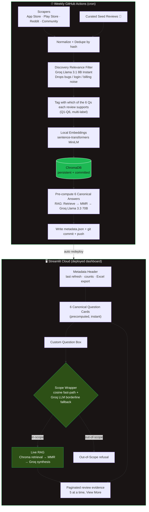

# Review Engine Architecture (the required 1-slider)

## Key design decisions

| Decision | Why |
|---|---|
| **Groq Llama 3.3 70B** for synthesis, Llama 3.1 8B for classification | Free, fast, large enough; 8B handles high-volume batch classification cheaply, 70B handles low-volume synthesis quality |
| **Local sentence-transformers** for embeddings | No API quota, no rate limits, deterministic |
| **ChromaDB persisted in repo** | Free deployment, no external vector DB needed, redeploys are zero-friction |
| **Pre-computed canonical answers** | Instant load on the dashboard; LLM only runs at refresh time (1 per question) |
| **Live RAG for custom questions** | Flexible, but rate-limited by scope wrapper so we don't blow the Groq quota |
| **Hybrid scope wrapper** | Cosine fast-path decides 95% of queries; LLM only escalates on borderline |
| **Curated seed reviews flagged 🌱** | Transparently supplements scraped data without compromising credibility |
