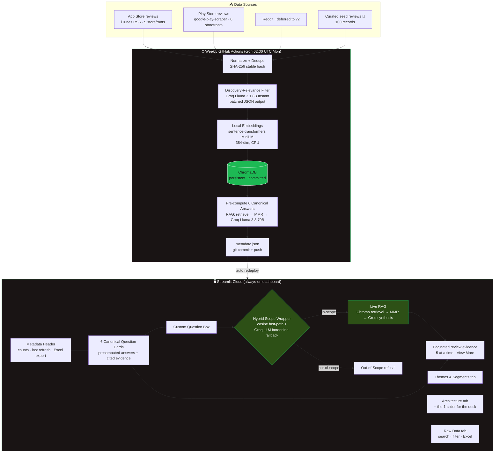
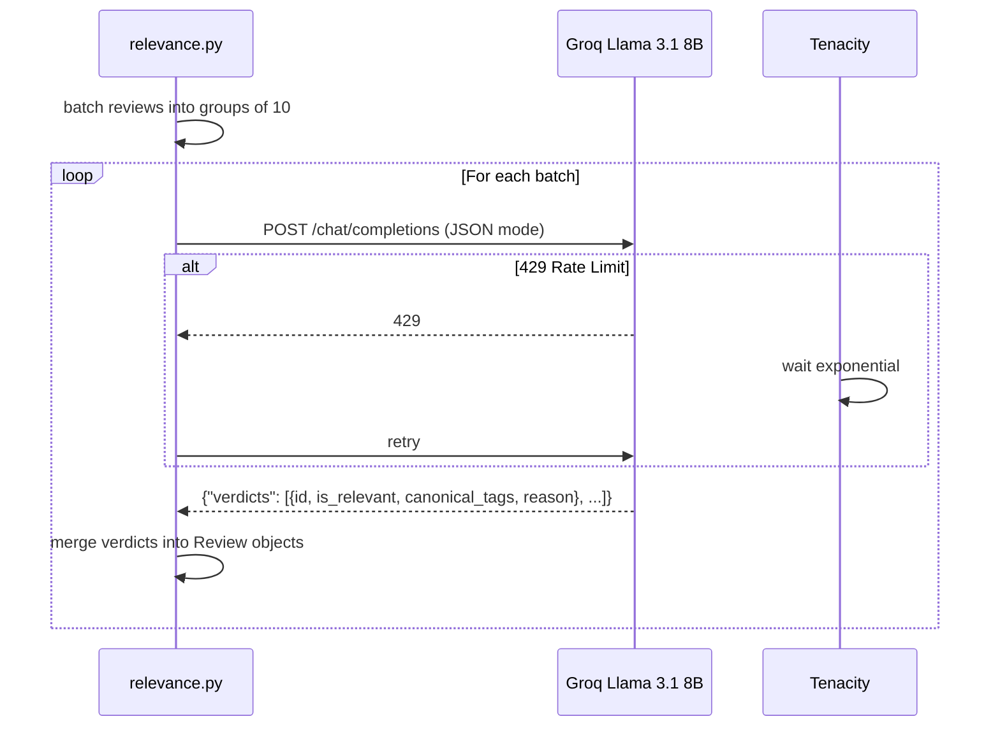
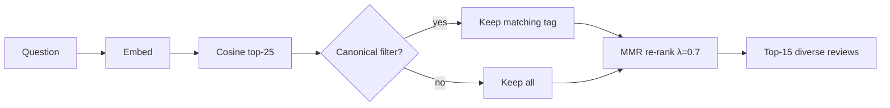
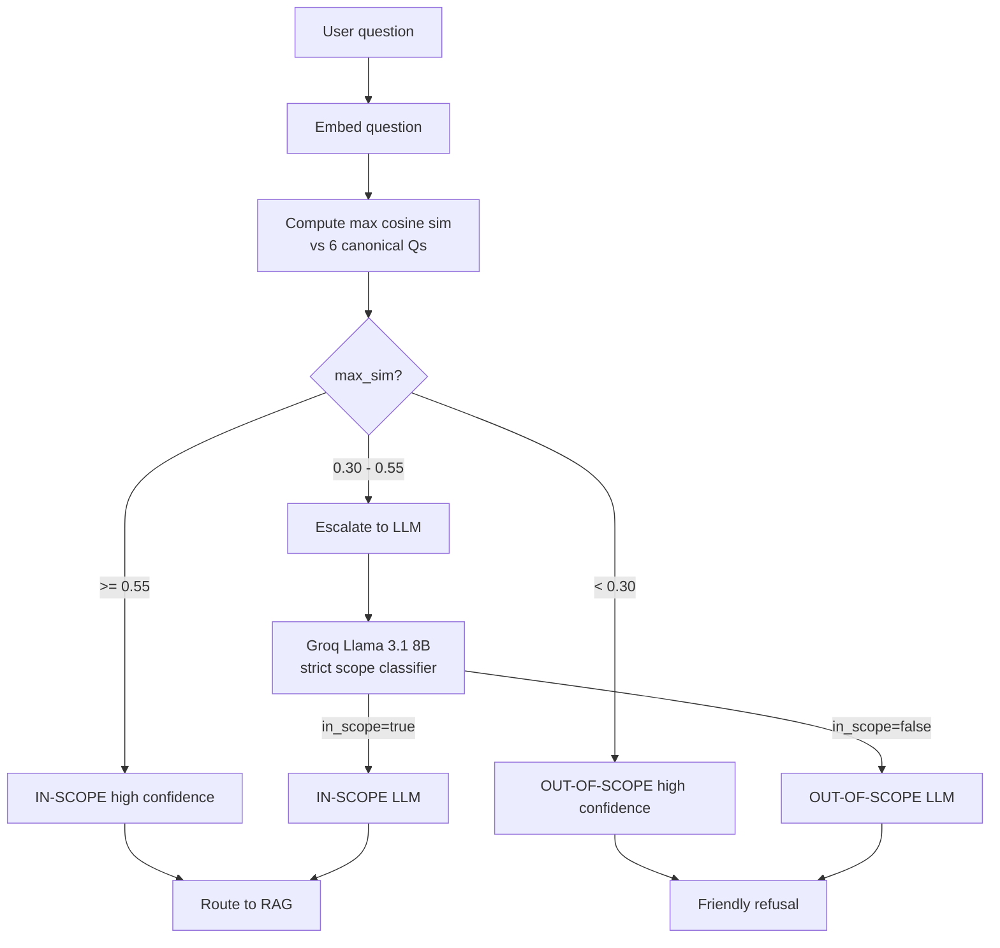
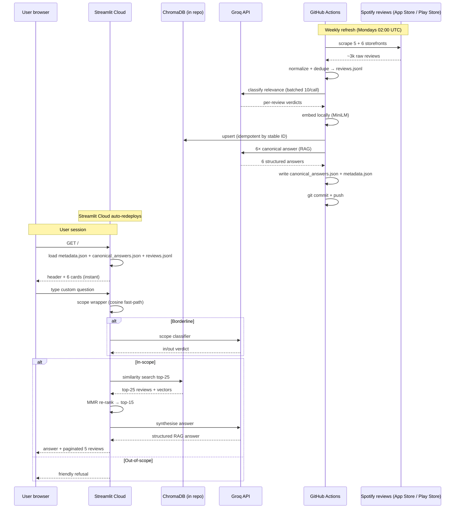

# Architecture — AI Review Discovery Engine (Part 1)

> Companion to [`problemStatement.md`](./problemStatement.md). Every component
> below maps to a concrete file in this repo and to one of the 11 functional
> requirements (R1–R11) in the brief.

---

## 1. System at a glance

---

## 2. Component-by-component walkthrough

Every component below lists: **what it does · file · inputs · outputs · why this design**.

### 2.1 Data ingestion

#### 2.1.1 App Store scraper
- **File:** `src/scrapers/appstore.py`
- **Mechanism:** Direct GET against Apple's public iTunes RSS endpoint:
  `https://itunes.apple.com/{country}/rss/customerreviews/page={page}/id=324684580/sortBy=mostRecent/json`
- **Storefronts:** US, GB, IN, DE, BR · up to 8 pages each (~400 reviews/storefront max)
- **Inputs:** none (network)
- **Outputs:** raw dict list with `id`, `text`, `rating`, `author`, `date`, `locale`, `url`
- **Why:** No API key needed, no third-party dependency that pins old `requests`. Native control over pagination + rate-limit politeness (`time.sleep(0.5)` per page).

#### 2.1.2 Play Store scraper
- **File:** `src/scrapers/playstore.py`
- **Mechanism:** `google-play-scraper` (active OSS, no key)
- **Storefronts:** `us`, `gb`, `in/en`, `in/hi`, `de`, `br` · 100–300 reviews each
- **Outputs:** same shape as App Store
- **Why:** Most mature scraper in the ecosystem; supports multi-locale; no auth.

#### 2.1.3 Curated seed reviews
- **File:** `data/seed/seed_reviews.jsonl` (100 records)
- **Mechanism:** Hand-authored to cover all 6 canonical questions × multiple segments × specific Spotify features
- **Transparency:** Tagged `source: "curated_seed"`; rendered with a 🌱 badge in the UI; mentioned in deck
- **Why:** Bootstraps a working v1 even before scrapers run; ensures rare segments (multilingual, niche genre, 50+ age cohort) are represented from day 1.

### 2.2 Normalization & dedupe

- **File:** `src/pipeline/normalize.py`
- **Functions:** `normalize_record(raw, source) → Review`, `merge_and_dedupe(reviews)`, `write_canonical_store(reviews)`
- **Stable ID:** `sha256(source + ":" + source_id)[:16]` — same review across re-scrapes produces the same ID → upserts are idempotent
- **Schema:** `src/schema.py` defines `Review` (Pydantic), including derived fields populated downstream: `is_relevant`, `canonical_tags`, `features_mentioned`, `user_segments`
- **Why JSONL:** Streaming-friendly, line-diff-friendly in git, no parquet/columnar dependency for tiny scale.

### 2.3 Discovery-relevance classifier (LLM filter)

- **File:** `src/pipeline/relevance.py`
- **Model:** Groq Llama 3.1 8B Instant (cheap + fast for high-volume classification)
- **Prompting:** System prompt embeds the 6 canonical questions + the full Spotify feature lexicon; instructs the model to output strict JSON for a batch of 10 reviews per call
- **Why batched:** Cuts per-review API cost ~10×; fewer rate-limit hits
- **Output per review:** `is_relevant` (bool), `reason` (one clause), `canonical_tags` (subset of Q1–Q6)
- **Rate-limit handling:** `tenacity` retry with exponential backoff (multiplier=2, min=2s, max=30s, 5 attempts) — verified working: actual run hit Groq 429s and auto-recovered

### 2.4 Embedding layer

- **File:** `src/pipeline/embed.py`
- **Model:** `sentence-transformers/all-MiniLM-L6-v2` (384-dim, ~80 MB, CPU)
- **Why local, not API:** Zero rate limit, zero cost, deterministic across runs; ~50 reviews/sec on a modern CPU
- **Normalisation:** `normalize_embeddings=True` → cosine similarity = dot product, simpler downstream math
- **Cached:** `@lru_cache` so the model loads once per process

### 2.5 Vector store — ChromaDB

- **Persistence:** `data/chroma_db/` (committed to repo)
- **Why committed:** Streamlit Cloud has no persistent disk between deploys; baking the index into the repo means every redeploy is zero-setup
- **Size budget:** ~10–20 MB for 5k reviews × 384-dim float32 → well below git's 100 MB warning
- **Collection name:** `spotify_reviews`
- **Metadata fields:** `source`, `rating`, `date`, `url`, `canonical_tags` (CSV), `features` (CSV), `author`
- **Upsert semantics:** stable review IDs ensure weekly refreshes update existing rows, never duplicate

### 2.6 Theme categorization (the 6 canonical themes)

- **Mechanism:** Done inline by the relevance classifier (single LLM call assigns relevance + canonical tags)
- **Multi-label:** A single review can support multiple Qs (typical: a Q1 review often also supports Q4)
- **Why LLM, not unsupervised clustering:** The 6 questions are pre-defined; we need *deterministic* mapping to those buckets, not emergent clusters. Clustering would be overkill and harder to defend to reviewers.
- **Future sub-themes:** v2 can layer HDBSCAN within each canonical bucket for emergent sub-themes (e.g., within Q1 → "filter bubble fatigue", "regional underexposure", "casual-user starvation").

### 2.7 RAG retrieval

- **File:** `src/rag/retrieve.py`
- **Step 1 — Initial similarity:** Chroma's HNSW cosine search retrieves top-25 (`RAG_RETRIEVE_K`)
- **Step 2 — Optional canonical filter:** When called from `precompute.py` with `filter_canonical=Q1_struggle`, only reviews tagged with that question are considered
- **Step 3 — MMR re-rank:** Greedy Maximal Marginal Relevance with λ=0.7 reduces near-duplicates to a final top-15 (`RAG_TOP_K`)
- **Why MMR:** Without it, the LLM sees 15 reviews that all say roughly the same thing; with it, the LLM sees 15 *diverse* reviews from the same theme → richer synthesis

### 2.8 RAG answer generation

- **File:** `src/rag/answer.py`
- **Model:** Groq Llama 3.3 70B Versatile (high-quality synthesis)
- **System prompt strictness:** "Use ONLY the provided reviews as evidence. Do NOT invent data."
- **Output schema (Pydantic):** `answer`, `spotify_features_mentioned`, `user_segments_affected`, `supporting_review_ids`, `confidence` (high/med/low)
- **Confidence rubric (in prompt):**
  - **high:** 8+ reviews directly support, multiple sources/segments agree
  - **medium:** 4–7 reviews support, some divergence
  - **low:** <4 reviews support OR heavy disagreement
- **Fallback:** If LLM returns invalid JSON, we fall back to a "Top relevant reviews retrieved — please read them" stub so the UI never empties

### 2.9 Scope wrapper (the "no-go for off-topic" guardrail)

- **File:** `src/rag/scope.py`
- **Architecture:** Two-stage hybrid

- **Why hybrid:** Fast-path decides ~95% of queries with **zero LLM calls** (verified during smoke test: in-scope sim=0.75, out-of-scope sim=0.04). The LLM only escalates on genuinely borderline queries (e.g. "how does Spotify decide what to show me?" — could be discovery, could be UX).
- **Thresholds calibration:** `SCOPE_IN_THRESHOLD = 0.55`, `SCOPE_OUT_THRESHOLD = 0.30` (in `src/config.py`)
- **Out-of-scope copy:** `OUT_OF_SCOPE_MESSAGE` in `scope.py` — friendly, redirects to the 6 questions

### 2.10 Pre-compute layer

- **File:** `src/rag/precompute.py`
- **What:** Computes all 6 canonical answers once per refresh and writes `data/insights/canonical_answers.json`
- **Why pre-compute:** 6 questions × 1 Groq call each = 6 LLM calls per refresh. Free-tier friendly. Dashboard loads them instantly; users never wait for the LLM on first render.
- **Custom questions still hit the live LLM** (rate-limited by Groq tier, but typically <1 request/min per user)

### 2.11 Streamlit dashboard

- **File:** `app/streamlit_app.py`
- **Theme:** Spotify dark (green `#1DB954` on black `#191414`) via inline CSS + `.streamlit/config.toml`
- **5 tabs:**
  1. **6 Canonical Questions** — card grid + expanded view with paginated evidence (5 at a time, "View More")
  2. **Ask Your Own** — scope-wrapped custom question box
  3. **Themes & Segments** — bar charts of feature mentions, canonical distribution, source mix
  4. **Architecture** — text-art diagram (= the 1-slider for the deck)
  5. **Raw Data** — searchable, filterable table; Excel download
- **Excel export:** `pandas.to_excel` with `openpyxl` — two buttons (all reviews / relevant only)
- **Metadata header:** Pills showing last refresh, total normalized, relevant count, Chroma size
- **Caching:** `@st.cache_data(ttl=300)` on data loaders so the UI is snappy

### 2.12 GitHub Actions weekly refresh

- **File:** `.github/workflows/refresh.yml`
- **Trigger:** `cron: "0 2 * * 1"` (Mondays 02:00 UTC) + `workflow_dispatch` (manual button)
- **Steps:**
  1. Checkout
  2. Set up Python 3.11 + pip cache
  3. Install deps
  4. Run `python -m src.pipeline.refresh`
  5. Print `data/metadata.json`
  6. Commit changes under bot identity, push back to main
- **Auto-redeploy:** Streamlit Cloud watches `main`; new commit → redeploy with refreshed data
- **Secrets:** `GROQ_API_KEY` (set in repo settings)

### 2.13 Smoke test

- **File:** `scripts/smoke_test.py`
- **Checks:** Env key, Groq SDK, embeddings, Chroma round-trip, scope wrapper routing, seed loadability
- **Outcome:** Verified end-to-end: all 6 checks pass

---

## 3. Data flow (end-to-end)

---

## 4. File ↔ functional requirement matrix

| Requirement | Files |
|---|---|
| R1 — Groq as primary LLM | `src/pipeline/groq_client.py`, `src/config.py` |
| R2 — RAG for classification + answering | `src/pipeline/relevance.py`, `src/rag/retrieve.py`, `src/rag/answer.py` |
| R3 — Auto-answer 6 canonical questions | `src/canonical.py`, `src/rag/precompute.py`, `data/insights/canonical_answers.json` |
| R4 — Scope wrapper (out-of-scope refusal) | `src/rag/scope.py` |
| R5 — Per-answer review evidence, 5+View More | `app/streamlit_app.py` (`render_answer_with_reviews`) |
| R6 — Curated seed reviews with transparency | `data/seed/seed_reviews.jsonl`, UI 🌱 badge |
| R7 — GitHub Actions weekly refresh | `.github/workflows/refresh.yml`, `src/pipeline/refresh.py` |
| R8 — Metadata header (counts, dates) | `data/metadata.json`, `app/streamlit_app.py` header |
| R9 — Excel export | `app/streamlit_app.py` `st.download_button` + `openpyxl` |
| R10 — Filter to relevant only, then categorize | `src/pipeline/relevance.py` + canonical tags |
| R11 — Spotify-specific lexicon in prompts | `src/lexicon.py` + injected into every system prompt |

---

## 5. Key design decisions (and their justifications)

| Decision | Alternative considered | Why we chose this |
|---|---|---|
| Two Groq models: 8B (classify) + 70B (synthesise) | 70B for everything | Cost & rate-limit math — classification is per-review (high volume), synthesis is per-question (6 calls). 8B is 10× cheaper. |
| Local sentence-transformers, not Groq/OpenAI embeddings | API embeddings | No rate limit, no quota burn, deterministic across deploys |
| ChromaDB committed to repo | External hosted vector DB | Free-tier-friendly; redeploys are stateless |
| Stable hash IDs | Auto-increment | Idempotent re-scrapes — same review never duplicates |
| Hybrid scope wrapper | LLM-only or cosine-only | 95% queries decided without LLM; LLM only for genuinely borderline (saves quota + latency) |
| Pre-computed canonical answers | Live LLM on every card | Dashboard loads instantly; Groq calls happen once per refresh, not per visitor |
| Curated seed reviews flagged in UI | Hidden / unflagged | Credibility: a reviewer who probes the data finds full transparency |
| Per-tab structure in Streamlit | Single long scroll | Cognitive load — each tab does one job well |
| Multi-locale scraping (US + UK + IN + DE + BR) | US-only | Surfaces regional/multilingual pain points that English-only would miss |

---

## 6. Operating envelope

| Dimension | v1 (now) | v2 (post-deck) |
|---|---|---|
| Reviews indexed | 97 (seed) → ~3k post-scrape | 10k+ with Reddit + Community |
| Refresh cadence | Weekly cron | Daily or on-demand |
| LLM calls per refresh | ~10 (classify) + 6 (synth) = 16 | ~300 + 6 |
| LLM calls per user query | 0 (canonical) / 1 (custom) | Same |
| Vector store size on disk | ~5 MB | ~30 MB |
| Free-tier viability | ✅ Yes, comfortably | ✅ Still within Groq + Streamlit free |

---

## 7. What this engine deliberately does *not* do

- **Does not answer questions about Spotify pricing, podcast bugs, login issues, etc.** — that's what the scope wrapper enforces.
- **Does not invent insights.** Every claim ties to retrieved review IDs.
- **Does not silently inflate the dataset.** Curated seeds are flagged.
- **Does not perform sentiment analysis as a separate stage.** Sentiment is implicit in the rating + canonical tagging; building a separate sentiment classifier added complexity without insight gain.
- **Does not run unsupervised clustering in v1.** Canonical tags cover the brief's 6 questions; clustering is a v2 enhancement.

---

## 8. Where to start reading the code

1. `doc/problemStatement.md` — the *why*
2. `src/canonical.py` — the 6 questions, the contract
3. `src/lexicon.py` — Spotify-domain vocabulary
4. `src/schema.py` — data shapes
5. `src/pipeline/refresh.py` — the orchestrator (read this top-to-bottom to understand the full pipeline)
6. `src/rag/scope.py` + `src/rag/answer.py` — the runtime engine
7. `app/streamlit_app.py` — the UI
8. `.github/workflows/refresh.yml` — the CI loop
